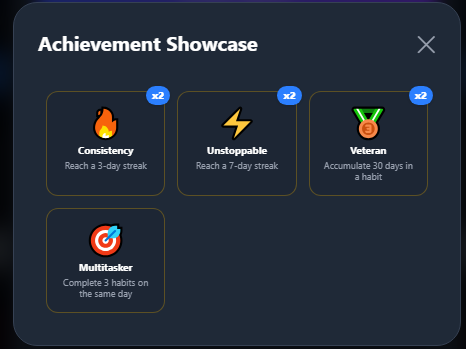
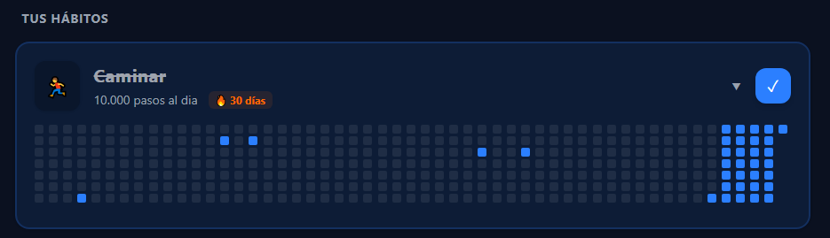
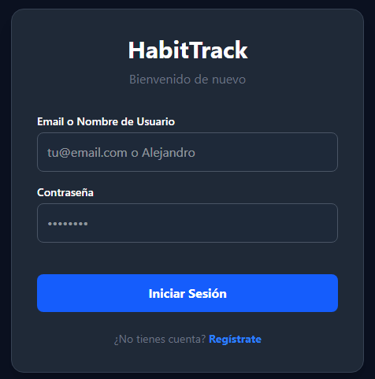

# 🎯 HabitTrack v2.0 — Full-Stack Serverless Tracker


> **🏆 Proyecto TFG (Grado Superior DAW) — Calificación: 10/10**

La ciencia demuestra que se necesitan una media de 66 días para consolidar un hábito. Bajo esta premisa psicológica nace **HabitTrack**: una aplicación web minimalista, libre de distracciones y basada en la gamificación y el refuerzo de *"no romper la cadena"*.

Nacida inicialmente como una SPA para mi Trabajo de Fin de Grado, la **v2.0** supone una reingeniería completa hacia una arquitectura **Full-Stack Serverless** con persistencia en la nube y aislamiento seguro de datos por usuario.

🌐 **Demo Funcional:** [\[Enlace a Vercel\]](https://habit-track-phi.vercel.app/)

---

## ✨ Novedades de la v2.0 (Reingeniería de Software)

* ♾️ **Motor de Tracking Infinito:** Refactorización del modelo de datos. Transición de un *array* estático a un diccionario de fechas en formato `{"YYYY-MM-DD": boolean}` almacenado en MongoDB, permitiendo un historial ilimitado con soporte para la zona horaria local del usuario.
* 🔐 **Seguridad y Aislamiento (JWT):** Implementación de una API REST propia con Node.js/Express. Las contraseñas están encriptadas con `bcryptjs` y un *middleware* personalizado garantiza que cada cuenta interactúe única y exclusivamente con sus propios documentos BSON.
* 🛡️ **Arquitectura Anti-Crash:** Blindaje del Frontend en React mediante *optional chaining* (`?.`) y validaciones estrictas de estado para evitar rupturas de renderizado (*White Screen of Death*) ante latencias de red.
* 🏆 **Sistema de Gamificación Expandido:** Motor de evaluación matemática retroactiva que desbloquea insignias en tres verticales: Serie de Rachas, Constancia a Largo Plazo y Productividad Diaria.
* 🌍 **Internacionalización (i18n):** Soporte multiidioma dinámico integrado en los ajustes de la aplicación.

## 🛠️ Stack Tecnológico

**Client-Side (Frontend):**
* **Core:** React (v19), JavaScript (ES6+), HTML5.
* **Estilos & UI:** Tailwind CSS v4 (*Zero-Configuration* nativo) con maquetación *Mobile First* y transiciones fluidas al *Dark Mode*.
* **Layout Avanzado:** Uso extensivo de `CSS Grid` para el diseño de la matriz anual interactiva sin saturar el árbol del DOM.

**Server-Side (Backend & Data):**
* **Entorno:** Node.js + Express.
* **Base de Datos:** MongoDB Atlas (NoSQL) modelado y validado mediante **Mongoose**.
* **Autenticación:** JSON Web Tokens (JWT) integrado en un `AuthContext` global para persistencia de sesión segura en el cliente.
* **Despliegue & CI/CD:** Vite + Vercel.

---

## 📸 Interfaz y Arquitectura





---

## 🚀 Instalación y Despliegue Local

Si quieres clonar el proyecto para inspeccionar el código o ejecutarlo en tu máquina local:

### 1. Clonar el repositorio
```bash
git clone https://github.com/AlejandroLuisReyDEV/habit-track.git
cd habit-track
```
### 2. Instalar dependencias
```bash
npm install
```
### 3. Configurar variables de entorno
```bash
MONGO_URI=tu_cadena_de_conexion_de_mongodb_atlas
JWT_SECRET=tu_palabra_secreta_para_firmar_tokens
```
### 4. Ejecutar el entorno de desarrollo
```bash
npm run dev
```

## 👨‍💻 Autor

Alejandro Luis Rey Junior Frontend / Web Developer

💼 LinkedIn: https://www.linkedin.com/in/alejandroluisreydev/

🐱 GitHub: [@AlejandroLuisReyDEV](https://github.com/AlejandroLuisReyDEV)

¿Tienes sugerencias de optimización para el código, consultas sobre el ecosistema Serverless o feedback general? ¡Las Issues y Pull Requests son siempre bienvenidas!